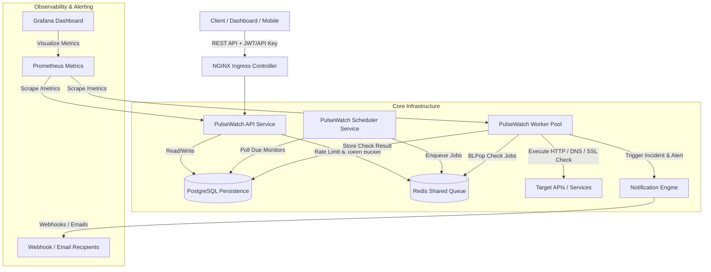

# PulseWatch ⚡

**PulseWatch** is a production-grade API Monitoring & Observability Platform built with Go 1.24, Gin, PostgreSQL, Redis, Docker, Kubernetes, Helm, Prometheus, and Grafana.

---

## 📐 Architecture Diagram



---

## 🛠️ Technology Stack

- **Backend Language**: Go 1.24
- **Web Framework**: Gin
- **Database**: PostgreSQL (with UUID support & JSONB)
- **Caching & Queue**: Redis v7
- **Monitoring & Metrics**: Prometheus & Grafana
- **Tracing**: OpenTelemetry (OTel)
- **Containerization**: Docker & Multi-stage Dockerfiles
- **Orchestration**: Kubernetes & Helm Charts
- **Ingress**: NGINX Ingress Controller
- **API Spec**: Swagger / OpenAPI 3.0
- **CI/CD**: GitHub Actions

---

## 📁 Repository Structure

```
.
├── cmd/
│   ├── api/          # PulseWatch REST API entrypoint
│   ├── scheduler/    # Ticker scheduler service pushing jobs to Redis
│   └── worker/       # Concurrent worker pool consuming jobs
├── deployments/
│   ├── docker/       # Multi-stage Dockerfiles & docker-compose.yml
│   ├── grafana/      # Grafana dashboards & datasources
│   ├── helm/         # Helm chart for Kubernetes deployment
│   ├── k8s/          # Native K8s manifests (Deployments, HPA, Ingress)
│   └── prometheus/   # Prometheus scrape configs
├── docs/             # OpenAPI / Swagger specification
├── internal/
│   ├── config/       # Environment configuration loader
│   ├── domain/       # Domain entities, value objects & errors
│   ├── handler/      # Gin HTTP request handlers & router
│   ├── middleware/   # JWT Auth, RBAC, Rate Limiter, Logger, Metrics
│   ├── queue/        # Redis job queue manager
│   ├── repository/   # Repository implementations (PostgreSQL)
│   ├── service/      # Business logic & monitoring checkers
│   └── telemetry/    # Prometheus & OpenTelemetry setups
├── migrations/       # SQL schema migrations & seed data
├── postman/          # Production Postman collection
├── Makefile          # Local development & build targets
└── go.mod            # Go module dependencies
```

---

## ✨ Core Features

1. **Authentication & Multi-Tenancy**:
   - JWT access tokens & refresh tokens with bcrypt password hashing.
   - Multi-tenant Organization structure with Project scoping.
   - RBAC permissions (`Owner`, `Admin`, `Member`).
   - Project API Keys with `X-API-Key` authentication.

2. **Monitoring Engine**:
   - **HTTP/HTTPS Monitoring**: Custom HTTP methods (GET, POST, PUT, DELETE), custom headers, payload bodies, Basic/Bearer/Header authentication, status code validation, response keyword lookup.
   - **SSL Expiry Monitoring**: TLS certificate verification and days-until-expiry alerts.
   - **DNS Lookup Monitoring**: Resolver lookup latency and IP record verification.
   - Configurable check intervals (10s to 10m) and timeout thresholds.

3. **Incident Management & Notifications**:
   - Automatic incident creation when consecutive check failures reach threshold.
   - Automatic incident resolution when consecutive successes reach recovery threshold.
   - Webhook & Email alerts dispatched on incident lifecycle events.

4. **Public Status Page**:
   - Unauthenticated status page endpoint (`/api/v1/public/status/:slug`) delivering real-time status, active incidents, and 90-day uptime metrics.

5. **Audit Logging & Dashboard Metrics**:
   - Audit logs for administrative actions within organizations.
   - Aggregated project dashboard endpoints (Uptime %, 24h average latency, status ratios).

---

## 🚀 Quick Start (Local Development)

### Prerequisites
- Docker & Docker Compose
- Go 1.24+ (optional for local running)

### 1. Launch with Docker Compose
```bash
make docker-up
```
This spins up PostgreSQL, Redis, PulseWatch API, Scheduler, Worker Pool, Prometheus, and Grafana.

- **API Endpoint**: `http://localhost:8080/api/v1`
- **Swagger Docs**: `http://localhost:8080/swagger/index.html`
- **Prometheus**: `http://localhost:9090`
- **Grafana**: `http://localhost:3000` (User: `admin`, Pass: `admin`)

### 2. Build Binaries Locally
```bash
make build
```

### 3. Run Tests
```bash
make test
```

---

## ☸️ Kubernetes & Helm Deployment

### Deploying via Helm
```bash
helm upgrade --install pulsewatch deployments/helm/pulsewatch \
  --namespace pulsewatch \
  --create-namespace
```

### Deploying via Manifests
```bash
kubectl apply -f deployments/k8s/namespace.yaml
kubectl apply -f deployments/k8s/
```

---

## 📄 License
MIT License.
